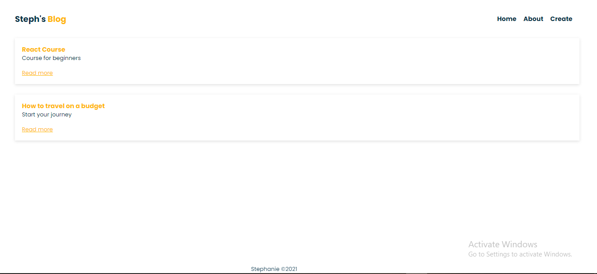
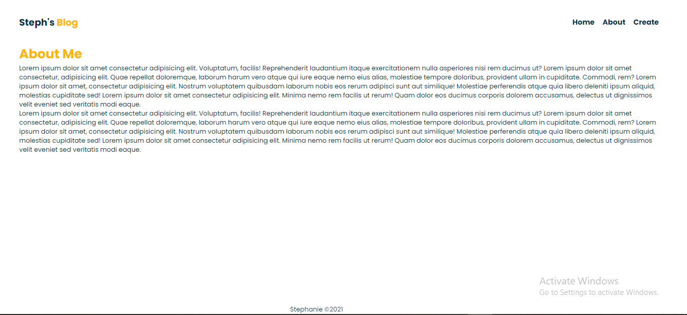
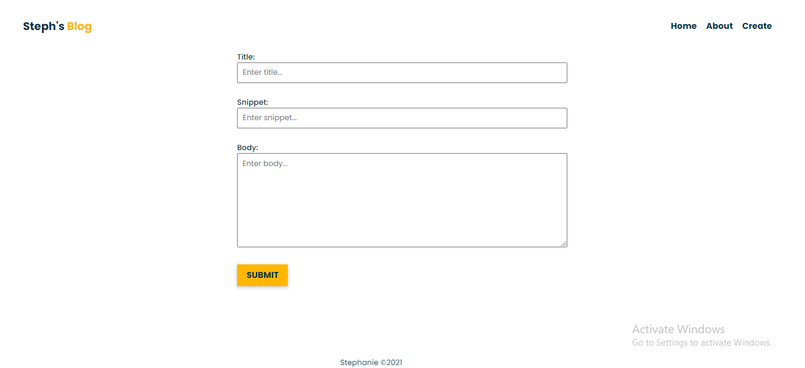
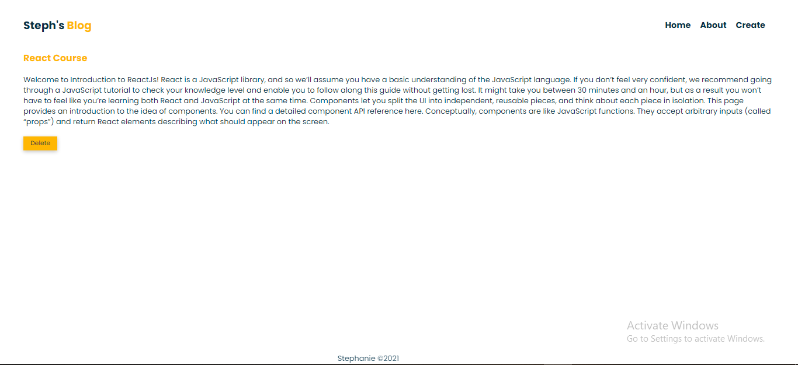

## Preview
### Home Page

### About Me Page

### Create Blog Page

### Blog details

## Technologies used:
Node.js
Express
MongoDB
HTML & CSS

## Use Case
A user is able to;
- Create a blog post using the form.
- View a preview of the blogs on the Home Page.
- Read the entire blog from the blog details page.
- Delete a blog post.

